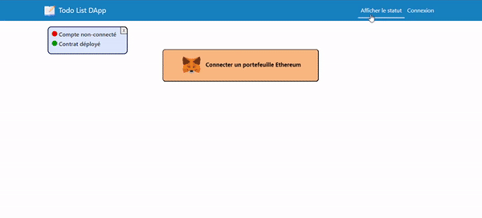

# Todo List DApp : Get Things Done 📝

 Utilisation de Solidity et ReactJS.

## Aperçu 👀

<p align="center">
    
</p>

## Développeurs 👨‍💻
- [Killian Monnier](https://github.com/mauxnier)
- [Abdella Boudaoud](https://github.com/https://github.com/Abd3lla)
- [Ikrame Bakkari](https://github.com/ikramebakkari)

## Utilisation 💻
Pour pouvoir utiliser l'application il vous faut un gestionnaire de compte Ethereum (comme `MetaMask`).

### Mise en place de MetaMask (utiliser l'extension navigateur)
- Créer un compte et changer le réseau en "localhost 8545"
- Faire "Import Account" et importer un des comptes qui a été créé dans le terminal (avec la commande npx hardhat node) avec sa clé privée.

Dans ./react-app, il faut lancer les commandes suivantes pour utiliser l'application:

### Création du noeud local
```console
npx hardhat node
```

### Lancer l'application react
```console
npm start
```

## Commandes utiles 🎨

### Compilation des changements du smart contract (si modification du fichier .sol dans le dossier ./react-app/contracts)
```console
npx hardhat compile
```

### Déploiement du smart contract (on peut utiliser le bouton "Déployer le contrat" dans l'application)
```console
npx hardhat run scripts/deploy.js --network localhost
```

### Test unitaire
```console
npx hardhat test
```

## Troubleshooting 💢
```console
MetaMask - RPC Error: [ethjs-query] while formatting outputs from RPC '{"value":{"code":-32603,"data":{"code":-32000,"message":"Nonce too high. Expected nonce to be 1 but got 8. Note that transactions can't be queued when automining.","data":{"message":"Nonce too high. Expected nonce to be 1 but got 8. Note that transactions can't be queued when automining."}}}}'
```
Il faut changer de compte ou réinitialiser le compte dans MetaMask -> paramètres -> paramètres avancés -> `réinitialiser le compte`.

## Documentation 📚
- [Comment créer une Dapp avec Solidity et ReactJS](https://www.youtube.com/watch?v=poyVa6yd4X8)

- [Utilisation de ce projet comme base de développement](https://github.com/Kavit900/task_management_dapp)
